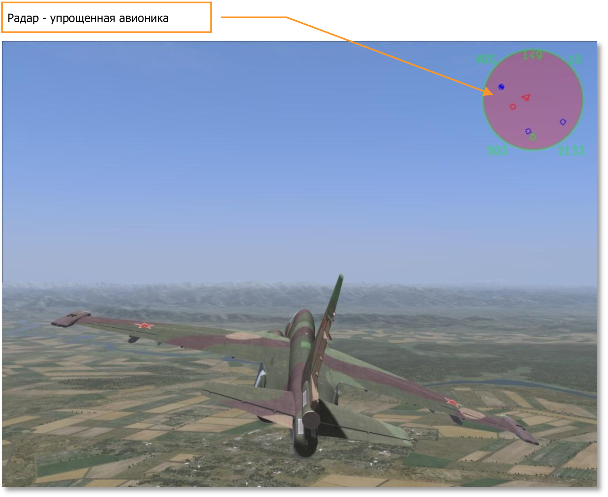
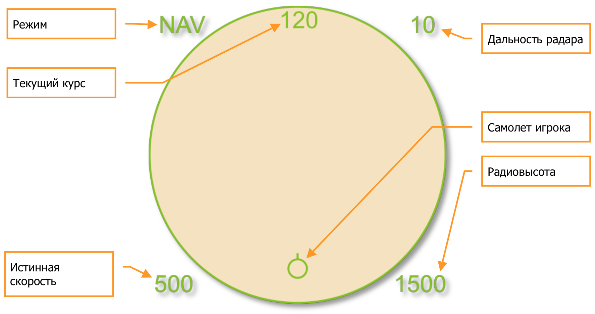
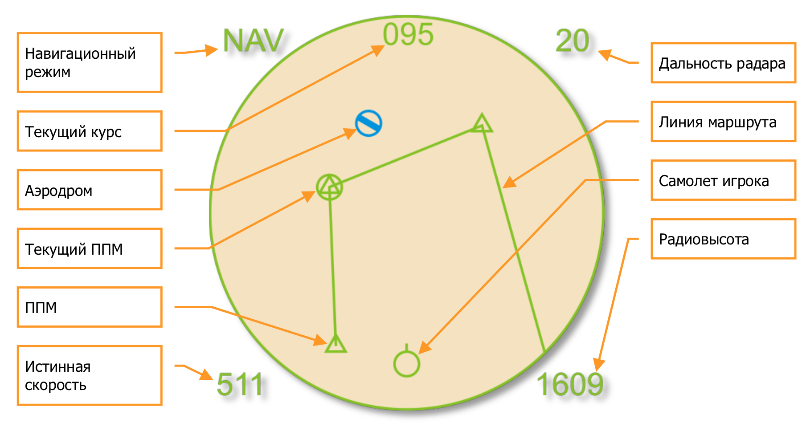
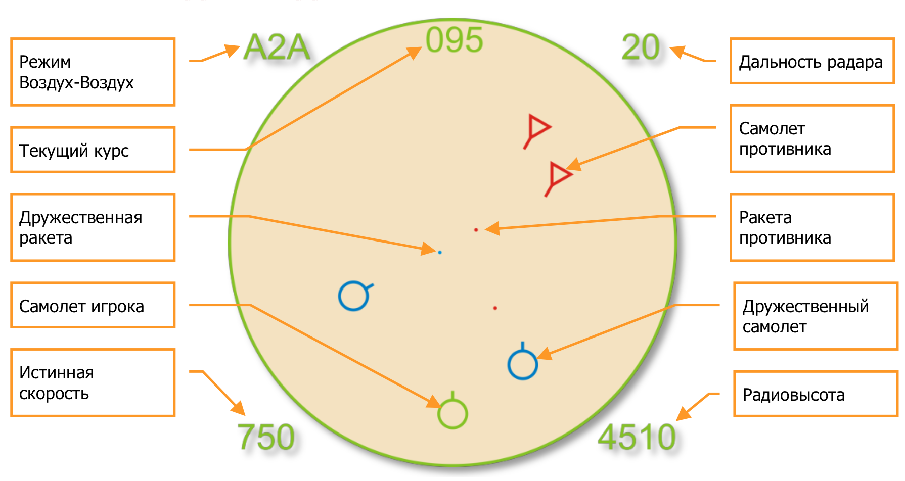
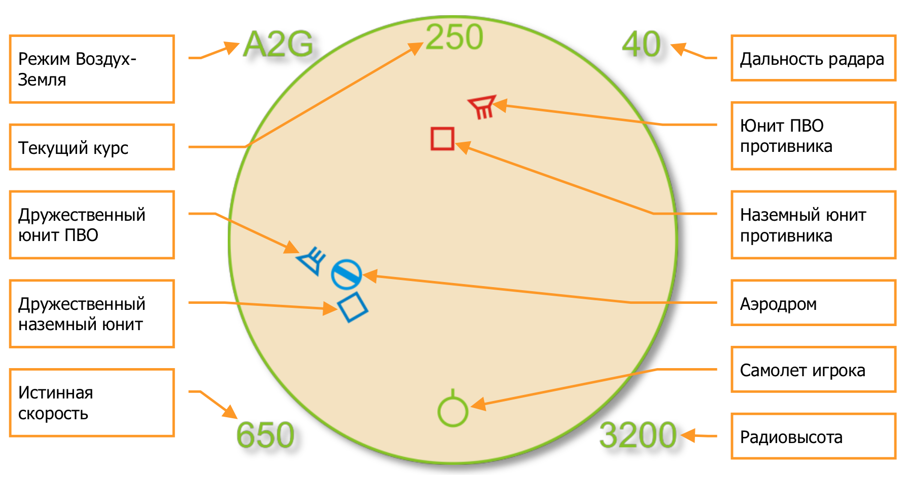

# Режим упрощённой авионики

Режим упрощенной авионики предназначен для новичков и пользователей, предпочитающих аркадные настройки. При включении упрощенной авионики в настройках сложности, (смотрите раздел «Игровые настройки» в руководстве по пользовательскому интерфейсу) в правый верхний угол экрана выводится радар, отображающий необходимую информацию в трех режимах: навигация, воздушный бой, работа по земле.

На радаре отображается плановый вид сверху вниз, в котором ваш самолёт находится в нижней части красного экрана. Объекты расположенные на экране выше, в пространстве находятся впереди вас, объекты, отображающиеся по бокам экрана, соответственно находятся правее и левее вашего самолёта.

Ряд цифр вокруг экрана отображают различные параметры полёта.

Набор параметров полёта отображается в каждом из трёх режимов радара вокруг экрана.

- **Режим.** Индикатор выбранного режима, навигация, воздушный бой, работа по земле.
    - NAV. Режим навигации. [[1]]
    - A2A. Режим Воздух-Воздух. [[2]]...[[6]]
    - A2G. Режим Воздух-Земля. [[7]]
- **Дальность радара.** Отображает дальность — масштаб экрана радара. Шкала дальности 2, 5, 10, 20, 40, 80, 160 км.
    - Увеличить масштаб: [[=]]
    - Уменьшить масштаб: [[-]]
- **Истинная скорость.** Отображает скорость перемещения самолёта относительно воздуха.
- **Радиовысота.** Отображает высоту самолёта над рельефом земли.
- **Текущий курс.** Отображает текущий курс самолёта в градусах.
- **Самолёт игрока.** Символ самолёта игрока неподвижен относительно экрана радара.

Ниже дается описание индикации радара в трех режимах, навигация, воздушный бой, работа по земле.

## Навигация

Уникальные символы представленные в навигационном режиме:

- **Аэродром.** Этот синий символ отображает позицию аэродромов.
- **Текущий ППМ.** Этот круглый символ отмечает текущий поворотный пункт маршрута (ППМ). Вы можете последовательно перебирать ППМ с помощью комбинации клавиш [[LCtrl — ~]].
- **ППМ.** Этот треугольный символ отображает все поворотные пункты маршрута (ППМ).
- **Линия маршрута.** Линия маршрута последовательно соединяет все ППМ.

## Режим Воздух-Воздух

Уникальные символы представленные в режиме воздух-воздух:

- **Дружественный самолёт.** Все самолёты вашей коалиции отображаются в виде синих колец с вектором скорости.
- **Самолёт противника.** Все самолёты коалиции противника отображаются в виде красных треугольников с вектором скорости.
- **Дружественная ракета.** Все ракеты выпущенные самолётами вашей коалиции отображаются синими точками.
- **Ракета противника.** Все ракеты выпущенные самолётами коалиции противника отображаются красными точками.

Клавиатурные команды для быстрого захвата типов целей:

- Автозахват ЛА в центре: [[RAlt]] + [[ F6]]
- Автозахват ближайшего ЛА: [[RAlt]] + [[ F5]]
- Автозахват следующего ЛА: [[RAlt]] + [[ F7]]
- Автозахват предыдущего ЛА: [[RAlt]] + [[ F8]]

## Режим Воздух-Земля

Уникальные символы представленные в режиме воздух-замля:

- **Дружественный наземный юнит.** Любой дружественный наземный юнит отображается синим квадратом.
- **Наземный юнит противника.** Любой наземный юнит противника отображается красным квадратом.
- **Дружественный юнит ПВО.** Любой дружественный юнит ПВО отображается синей трапецией с тремя штрихами.
- **Юнит ПВО противника.** Любой юнит ПВО противника отображается красной трапецией с тремя штрихами.

Клавиатурные команды для быстрого захвата типов целей:

- Автозахват наземной цели по центру: [[RAlt]] + [[ F10]]
- Автозахват ближайшей наземной цели: [[RAlt]] + [[ F9]]
- Автозахват следующей наземной цели: [[RAlt]] + [[ F11]]
- Автозахват предыдущей наземной цели: [[RAlt]] + [[ F12]]

{!abbr.md!}
