# Приборное оборудование

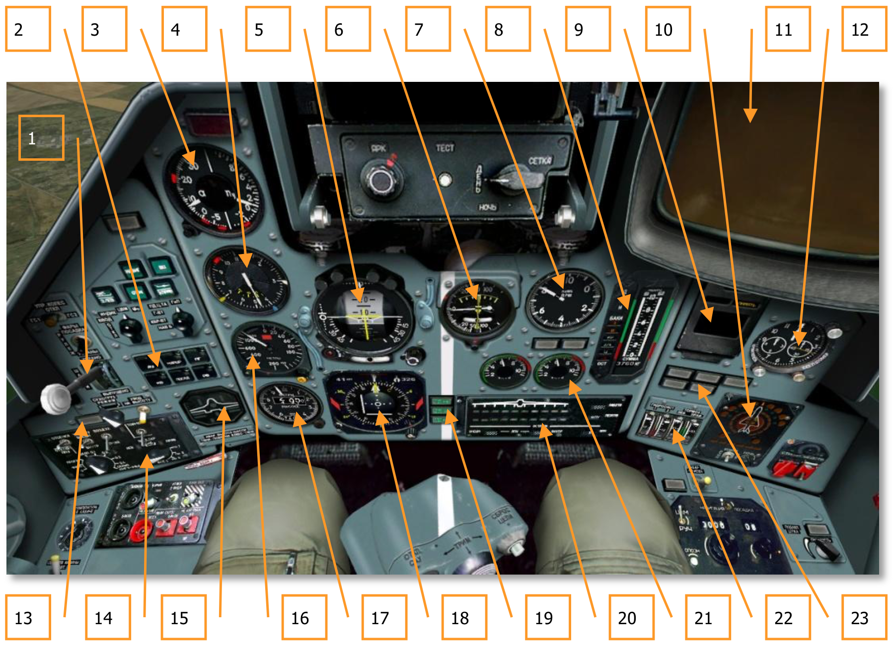

1. Кран шасси.
2. Щиток САУ.
3. Комбинированный указатель угла атаки и перегрузки.
4. Комбинированный указатель скорости.
5. Командно-пилотажный прибор.
6. Указатель вертикальной скорости.
7. Указатель оборотов двигателей.
8. Топливомер.
9. Панель системы "Экран".
10. СПО-15 "Береза".
11. Телевизионный индикатор ИТ-23М.
12. Часы.
13. Световой индикатор работы системы "Сухогруз".
14. Щиток системы управления вооружением.
15. Пилотажно-посадочный индикатор.
16. Радиовысотомер.
17. Барометрический высотомер.
18. Плановый навигационный прибор.
19. Индикаторы нейтральных положений триммеров в каналах тангажа, крена и рысканья.
20. Панель системы управления вооружением.
21. Указатели температуры газа за турбинами.
22. Указатели давления в гидросистеме.
23. Светосигнальное табло.

### Указатель скорости

Указатель скорости предназначен для индикации приборной скорости полета самолета. Шкала указателя скорости проградуирована в пределах от 0 до 1100 км/час

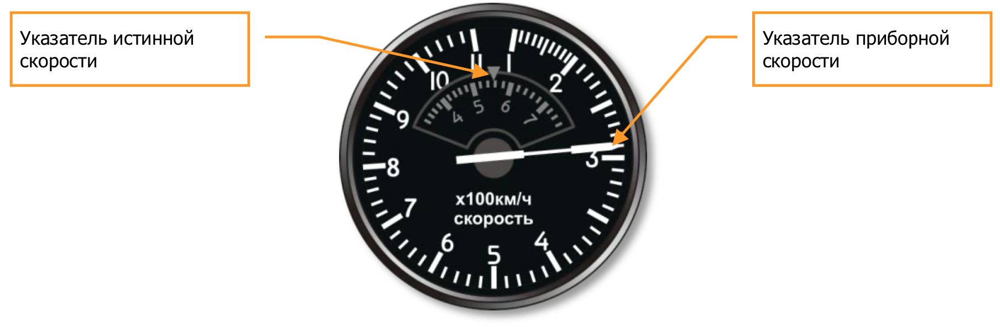

### Пилотажно-посадочный индикатор

Пилотажно-посадочный индикатор предназначен для световой сигнализации положения шасси, закрылков и тормозных щитков. Если одна из стоек шасси не заняла выпущенное или убранное положение, то в центре индикатора загорается лампа красного цвета.

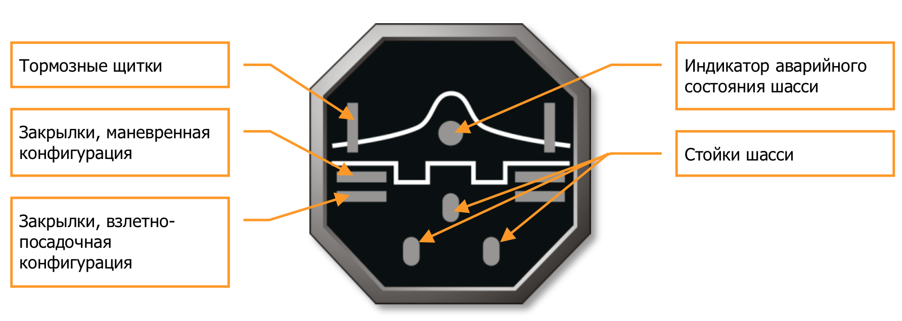

### Указатель угла атаки и перегрузки

Указатель угла атаки и перегрузки предназначен для индикации текущих значений местного угла атаки и нормальной перегрузки. На левой стороне указателя отображаются значения угла атаки в градусах. Значения нормальной перегрузки в единицах G отображаются на правой шкале указателя.

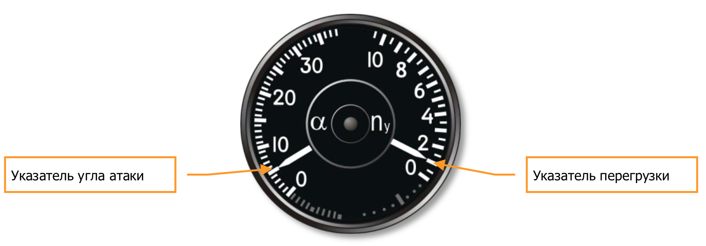

### Командно-пилотажный прибор (КПП)

Командно-пилотажный прибор (КПП) предназначен для индикации текущих значений углов тангажа и крена самолета. В нижней части прибора расположен указатель скольжения - "шарик". Отклоняя с помощью педалей рули направления можно ликвидировать возникающее скольжение, добиваясь центрального положения "шарика".

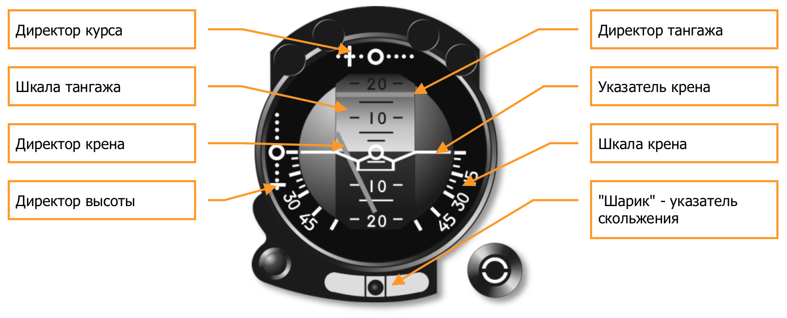

На лицевой части прибора расположены директор крена и директор тангажа, которые показывают отклонение траектории полета самолета от заданной. Когда обе планки находятся в центральном положении, самолет находится на заданной траектории полета.

При инструментальной посадке маневром самолета необходимо добиваться минимального отклонения планок директора высоты и директора курса от центрального положения.

### Прибор навигационный плановый (ПНП)

Прибор навигационный плановый (ПНП), предназначен для контроля положения самолета относительно заданной линии пути в горизонтальной плоскости, сторон света, а также радиоориентиров при полете по маршруту и заходе на посадку. Подвижная шкала текущего курса вращается относительно неподвижной метки. Метка текущего курса находится в верхней части прибора.

На счетчике дальности отображается дальность до текущей точки маршрута.

Внутри курсовой шкалы имеется стрелка указателя заданного курса. Она показывает направление заданного курса на текущую точки маршрута в плане.

Указатель курсового угла на навигационный ориентир показывает прямое направление на текущую точку маршрута. Дальность до текущей точки маршрута измеряется в километрах. При точном выдерживании маршрута полета стрелка курсового угла на навигационный ориентир должна совпадать с указателем заданного курса.

Планка отклонения от равносигнальной зоны курсового радиомаяка расположена в центральной части прибора. Она отображает отклонение текущего положения самолета от линии заданного курса. При посадке по ILS эта планка показывает отклонение самолета от глиссады.

### Указатель вертикальной скорости, поворота и скольжения

Указатель вертикальной скорости (вариометр) предназначен для измерения и индикации вертикальной скорости самолета, т. е. скорости подъема или спуска. Указатель скольжения дублирует указатель скольжения на КПП.

Указатель скольжения указывает на направление скольжения, однако, он не может дать количественную информацию о величине скольжения.

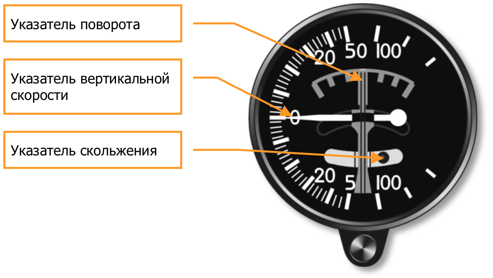

### Радиовысотомер

Радиовысотомер предназначен для индикации истинной высоты полета самолета. Диапазон измеряемых высот лежит в пределах от 0 до 1500 метров.

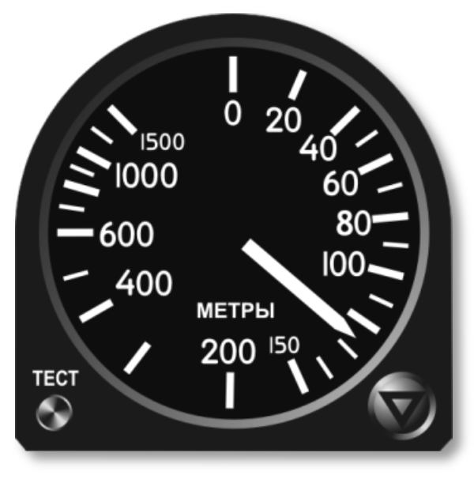

### Указатель оборотов двигателей

Указатель оборотов двигателя предназначен для индикации числа оборотов роторов обоих двигателей. Измерения индицируются в процентах от величин максимальных оборотов.

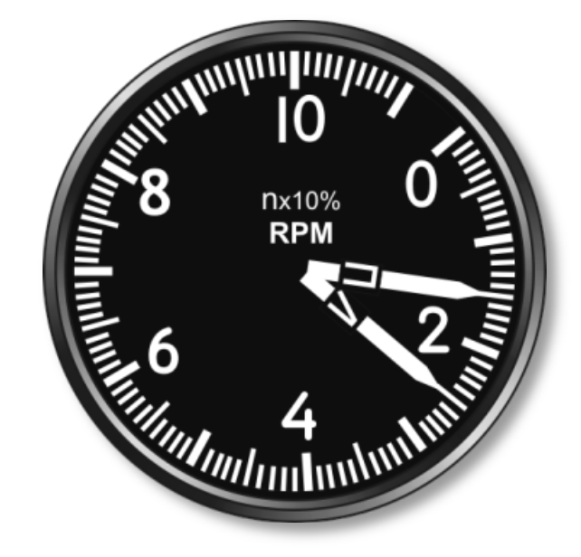

### Топливомер

Шкала "Р" предназначена для индикации остатка топлива в основных баках. Шкала "Т" индицирует остаток топлива в расходном баке.

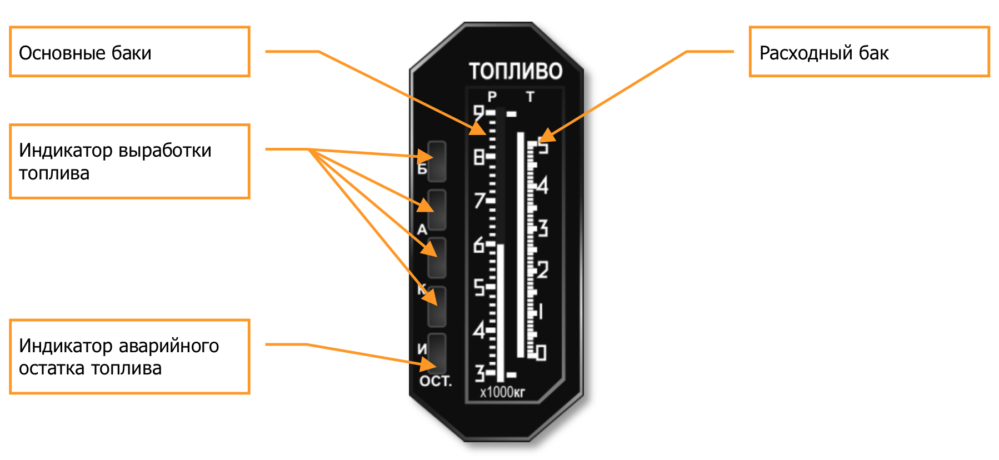

### Индикаторы температуры газов

Индикаторы температуры газов за турбиной показывают значения температуры газов, в градусах Цельсия, за турбинами левого и правого двигателей.

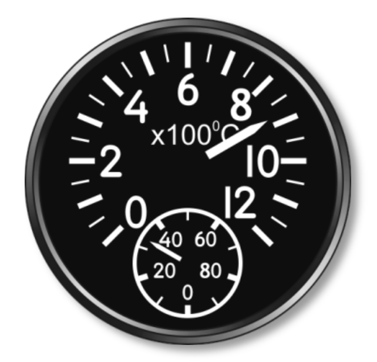

### Система предупреждения об облучении (СПО)

На индикаторе СПО отображается информация о радиолокационных станциях облучающих самолет (угрозах). Информация выдается в виде символов обозначающих тип и направление на облучающие самолет РЛС. Шесть световых индикаторов в нижней части, информируют летчика о типах облучающих самолет РЛС. Система выдает предупреждение об облучении от всех источников, как враждебных, так и дружественных.

Система обеспечивает устойчивый прием сигналов облучения РЛС в пределах +/- 180 градусов по азимуту и +/-30 градусов по углу места.

Количество одновременно отображаемых источников облучения – не ограничено.
Время хранения данных об источнике – 8 секунд.

Режимы индикации – "обзор/захват" (АЗС "ОБЗОР/ОТКЛ" в кабине МиГ-29).

Перед носом силуэта самолета находится индикатор исправности. В случае нормальной работы системы этот индикатор светится желтым светом.

Типы облучающих РЛС:

**П** — РЛС класса "Воздух-Воздух"
**З** — РЛС дальнего радиуса действия
**X** — РЛС среднего радиуса действия
**H** — РЛС ближнего радиуса действия
**F** — Наземная РЛС системы раннего обнаружения
**C** — РЛС системы ДРЛО

Лампы индикации относительного превышения, мощности сигнала РЛС и лампа "Захват/Пуск" показывают соответствующие параметры только для текущей главной цели.

Если период обзора РЛС не превышает 8 секунд то лампы "пеленг" горят непрерывно. В режиме обзора в наушники выдается прерывистый сигнал низкого тона.

При переходе РЛС в режим захвата, загорается центральная лампа красного цвета "Захват/пуск" и в наушники выдается непрерывный сигнал высокого тона.

В случае обнаружения факта пуска ракеты, лампа "Захват/пуск" начинает мигать и в наушниках слышен прерывистый сигнал высокого тона.

Активная ракета, после захвата цели АРГСН, обнаруживается системой и всегда классифицируется в качестве главной угрозы. Для этого типа угрозы характерно быстрое увеличение мощности сигнала (последовательное загорание ламп "Мощность сигнала") который можно интерпретировать как относительную дальность до ракеты.

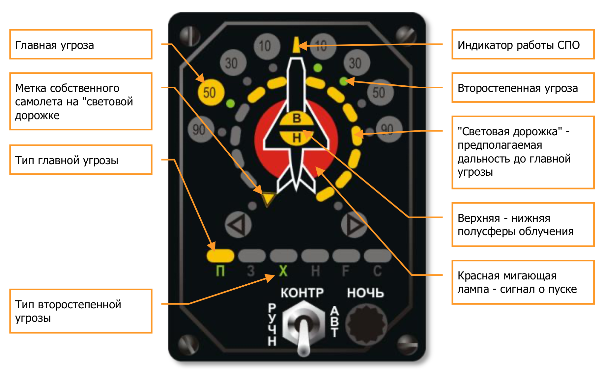

Умение правильно интерпретировать информацию, индицирующуюся на панели СПО, является жизненно необходимым навыком в боевой обстановке.

Как пример рассмотрим сложившуюся ситуацию на примере рисунка выше. Как видно из рисунка, на панели СПО отображены две угрозы:

- Главная угроза с направления 50 градусов (10 часов) отображается большим оранжевым индикатором. Оранжевый индикатор, в ряду типов угроз, горит над символом "**П**", обозначающим "перехватчик", в класс которых входят все истребители. Круговая шкала мощности сигнала ("световая дорожка") состоящая из оранжевых сегментов, показывает относительную мощность излучения главной угрозы. Большой красный индикатор под символом самолета сообщает о захвате вашего самолета РЛС главной угрозы. Горящие сегменты верхней и нижней полусферы атаки "**В**" и "**Н**", в центре силуэта самолета, сообщают, что угроза находится на одной высоте с вами, в пределах угла места 15 градусов. Следовательно, интерпретировать все это можно так: ваша главная угроза это самолет истребитель, приближающийся с направления 10 часов, примерно на одной высоте с вами, и, судя по факту захвата и относительной мощности, готовый к пуску ракет.

- Вторичная угроза находится на азимуте 10-30 градусов (1-2 часа), отображается зелеными круглыми индикаторами. Зеленый индикатор "**Х**" в ряду типов угроз сообщает, что вас облучает ЗРК средней дальности. Больше никакой информации по вторичным угрозам не выводится.

В сложной радиолокационной обстановке бывает непросто определить направление и типы угроз, в этом случае рекомендуется пользоваться фильтром [[RShift-R]] отсекающим все РЛС в режиме обзора. В результате на панели СПО будут индицироваться только РЛС, которые находятся в режиме захвата вашего самолета.
Система СПО является источником многочисленных звуковых сигналов, регулировать громкость которых, можно клавишами [[RAlt-,]] – [[RAlt-.]].

### Панель СУВ

Панель системы управления вооружением находится в нижней части приборной доски. На панели индицируется тип и состояние выбранных АСП, а также остаток боекомплекта пушки.

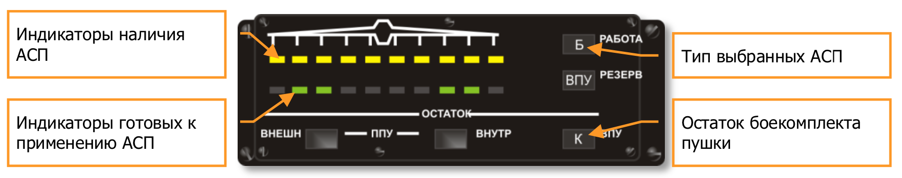

- Желтые индикаторы наличия АСП индицируют наличие боеприпасов на узлах подвески самолета. При сбросе боеприпасов они гаснут.
- Зеленые индикаторы готовых к применению АСП индицируют выбранные и подготовленные к пуску/сбросу боеприпасы на узлах подвески.
- На индикаторе типа выбранных АСП индицируется тип выбранных к применению боеприпасов: 
    Б – бомбы; 
    УР – управляемые ракеты; 
    НРС – неуправляемые ракеты; 
    ВПУ – встроенная пушечная установка.
- Индикатор остатка боекомплекта ВПУ имеет значения: 
    К – полный боекомплект; 
    1/2 – половина боекомплекта; 
    1/4 – четверть боекомплекта; 
    Зебра – боекомплект израсходован.

### Щиток системы управления вооружением

Щиток системы управления вооружением находится с левой стороны приборной панели внизу. Щиток служит для выбора режимов применения оружия, установки количества применяемых боеприпасов [[LCtrl-Space]] и интервала сброса между ними [[V]].

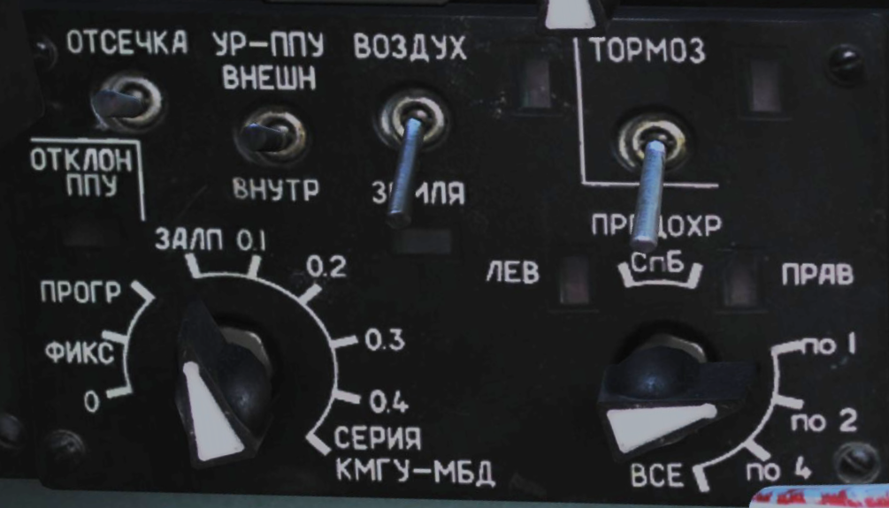

Органы управления системы управления оружием:

- Переключатель режимов разгрузки с положениями **ЗАЛП – 0.1 - 0.2 – 0.3 – 0.4 – СЕРИЯ КМГУ-МБД**. Положения **0 – ФИКС - ПРОГР** для применения СППУ.
- Переключатель вариантов разгрузки с положениями **ПО 1 - ПО 2 – ПО 4 – ВСЕ**.

Переключатель режимов разгрузки необходим для установки интервала разгрузки авиационных средств поражения и управления режимами стрельбы подвесных пушечных установок.

**ЗАЛП** – все выбранные к применению АСП разгружаются одновременно.

**0.1–0.4** - время в секундах (интервал) между разгрузкой отдельных АСП.

**СЕРИЯ КМГУ-МБД** – специальный режим разгрузки для контейнеров мелких грузов (КМГУ) и многозамковых балочных держателей (МБД). При этом разгрузка одного КМГУ происходит за 2 секунды, затем происходит разгрузка следующего КМГУ и т.д. по количеству выбранных к разгрузке КМГУ. Разгрузка одного МБД происходит за 0.3 секунды, затем происходит разгрузка следующего МБД и т.д. по количеству выбранных к разгрузке МБД.

**0** – режим стрельбы из СППУ с нулевым отклонением стволов, при стрельбе с пикирования.

**ФИКС** – режим стрельбы из СППУ с фиксированным отклонением стволов, при стрельбе с горизонтального полета по протяженным целям. Отклонение стволов осуществляется клавишами [[RCtrl-[ ]] и [[RCtrl-] ]].

**ПРОГР** – режим стрельбы с программным отслеживанием точки прицеливания. Необходимо использование лазерного дальномера. Используется при стрельбе с горизонтального полета по малоразмерной цели в переднюю полусферу.

Переключатель вариантов разгрузки необходим для установки количества АСП для разгрузки [[LCtrl-Space]].

**ПО 1 – ПО 2 – ПО 4 – ВСЕ** – количество назначенных для разгрузки АСП.

Необходимо отметить, что даже если установлен порядок разгрузки по 1-му АСП (ПО 1), с точек подвески 2, 3, 9, 10 всегда будет происходить разгрузка с двух симметрично расположенных пилонов. Это необходимо для исключения возникновения значительных моментов по крену и рысканию, возникающих в случае ассиметричной подвески.

МБД разгружаются всегда полностью. Сброс отдельных бомб с балочного держателя невозможен.

При применении пушечного оружия положения переключателя вариантов разгрузки будут обозначать следующее:

**ПО 1** – применение ВПУ.

**ПО 2** – применение пары СППУ.

**ПО 4** – применение всех СППУ.

В случае выбора СППУ возможна стрельба в горизонтальном полете по протяженной цели в режиме ФИКС. Для этого, клавишами [[RCtrl-=]], [[RCtrl--]] необходимо отклонить стволы на заданный угол, контролируя его по положению прицельной марки на ИЛС.

В случае необходимости применения сосредоточенного огня по малоразмерной цели из горизонтального полета, необходимо применять режим ПРОГР. Для этого необходимо отклонить стволы на заданный угол, клавишами [[RCtrl-=]], [[RCtrl--]] включить лазерный дальномер [[RShift-O]], маневром самолета наложить прицельную марку на цель и нажать гашетку. При начале стрельбы стволы пушечных установок будут автоматически отслеживать изменяющееся положение цели в вертикальной плоскости.

### Щиток САУ

Щиток САУ-8 находится с левой стороны приборной панели. Щиток служит для индикации режима работы САУ и состоит из шести кнопок со световыми индикаторами.

Перечень режимов САУ:

- Маршрут и посадка
- Боевое применение
- Стабилизация угловых положений (крен и тангаж)
- Стабилизация барометрической высоты и угла крена
- Приведение к горизонту
- Стабилизация барометрической высоты
- Стабилизация радиовысоты с автоматическим режимом — "увод с опасной высоты"
- Режим "Коррекция"

Все режимы стабилизации углов и высоты при включении, используют в качестве заданных текущие параметры полета.

Во всех режимах, кроме "Приведение к горизонту", МАРШРУТ и ПОСАДКА, автопилот имеет ограничения: ±60 градусов по крену и ±35 по тангажу. При превышении указанных ограничений, автопилот отключается. Включить любой режим, находясь за пределами ограничений, нельзя.

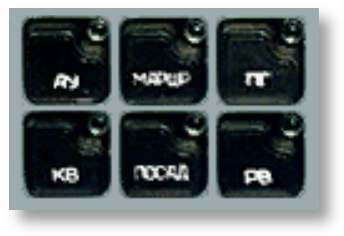

Автопилот имеет следующие ограничения по углу атаки и перегрузке (по показаниям прибора). Угол атаки - 15 градусов. Перегрузка — от 0 до 3 единиц. Не рекомендуется включать автопилот при значениях текущего угла атаки, превышающих 12 градусов. Если при включенном автопилоте приборный угол атаки превысит значение 12 градусов, необходимо увеличить приборную скорость полета (дачей РУДов).

Режим "Коррекция" включается клавишами [[LAlt-~]] во всех режимах автопилота (соответствует гашетке САУ на РУС самолета). На время удержания кнопки текущий режим автопилота отключается, что дает возможность корректировать заданные к выдерживанию параметры. Режим имеет особенности при боевом применении (см. описание режима "Боевое применение" ниже).

Любой режим автопилота отключается клавишами [[LAlt-9]] (соответствует гашетке "Откл. САУ" на РУС самолета).

- Режим МАРШРУТ - **АУ-МАРШР**. Включается клавишей [[А]] или [[LAlt-6]] при работающих навигационных режимах МАРШРУТ [[1]] и ВОЗВРАТ [[1]] – второе нажатие. Автопилот выдерживает направление на очередной ПМ и заданную на маршруте барометрическую высоту.
- Режим ПОСАДКА - **АУ-ПОСАД**. Включается клавишей [[А]] или [[LAlt-6]] при работающем навигационном режиме ПОСАДКА [[1]] – третье нажатие или автоматически из режимов МАРШРУТ и ВОЗВРАТ. Осуществляет автоматическое выдерживание положения самолета относительно равносигнальных зон курсо- глиссадных радиомаяков аэродрома посадки. Режим отключается автоматически при достижении высоты 50 метров по радиовысотомеру. При уходе из равносигнальной зоны курсового или глиссадного маяков режим ПОСАДКА сбрасывается и автоматически включается режим "Приведение к горизонту". При заходе на посадку с использованием режима ПОСАДКА стандартной практикой является отключение автопилота на высотах 100 - 200 метров по показаниям радиовысотомера. Заход в автоматическом режиме до высоты 50 м (минимально возможная с использованием САУ-8) рекомендуется только в условиях отсутствия видимости полосы (туман).
- Режим "Боевое применение" - **АУ-МАРШР-КВ**. Включается клавишей [[А]] или [[LAlt- 6]] при наличии информации о сопровождаемой цели (или точке на земной поверхности) от комплекса "Шквал". В этом режиме автопилот управляет по крену так, чтобы вектор скорости самолета совпадал с направлением на захваченную цель (точку). В канале тангажа осуществляется стабилизация барометрической высоты на момент включения режима.
При включении режима "Коррекция" **АУ-МАРШР** (зажатии гашетки САУ на РУС – [[LAlt-~]]) летчик может управлять самолетом в канале тангажа. При этом управление по крену осуществляется автопилотом. После отключения режима "Коррекция" (отжатии гашетки САУ - [[LAlt-~]]), автопилот возвращает самолет на исходную
высоту, заданную при включении режима "Боевое применение".
- Режим "Стабилизация угловых положений" - **АУ**. Включается клавишами [[LAlt-1]]. Осуществляет стабилизацию углов крена и тангажа.
- Режим "Стабилизация высоты барометрической и углов крена" - **АУ-КВ**. Включается клавишами [[LAlt-2]]. Осуществляет стабилизацию барометрической высоты и углов крена. Наиболее применим при необходимости выполнить разворот (вираж) на постоянной высоте.
- Режим "Приведение к горизонту" - **АУ-ПГ**. Включается клавишами [[LAlt-3]]. Выполняет приведение самолета к горизонту из любого исходного пространственного положения. При начальном угле крена большем, чем ±80 градусов, управление выполняется только по крену. В дальнейшем включается управление по тангажу. При достижении текущих углов ±7 градусов по крену и ±5 тангажу включается режим стабилизации угла крена 0 градусов и текущей барометрической высоты.
- Режим "Стабилизация барометрической высоты" **АУ-КВ**. Включается клавишами [[H]] или [[LAlt-4]]. Стабилизирует текущую барометрическую высоту на момент включения режима.
- Режим "Стабилизация радиовысоты" **АУ-РВ**. Включается клавишами [[LAlt-5]]. Стабилизирует текущую, на момент включения режима, радиовысоту с использованием информации от радиовысотомера. В этом режиме возможно автоматическое включение режима "Увод с опасной высоты".

Параметры, при которых включается увод:

- Текущая радиовысота меньше половины заданной с учетом скорости изменения;
- Вертикальная скорость при снижении достигла или превысила значение -50 м/с.

Во всех режимах, кроме навигационных (в навигационном при отсутствии выбранного ППМ, или захвата КГРМ) и боевого с сопровождением цели комплексом "Шквал", включение автопилота означает включение режима "Приведение к горизонту" с загоранием соответствующей сигнализации на пульте САУ-8.

В режиме ПОСАДКА, при боковой составляющей ветра более 10 м/с, рекомендуется отключать автопилот на высоте не менее 100 м с последующим переходом на ручное управление.

Режим "Увод с опасной высоты" работает в следующих режимах: "Стабилизация радиовысоты", "Стабилизация барометрической высоты", "Стабилизация угловых положений", а также в режимах МАРШРУТ и ПОСАДКА при включенной стабилизации угловых положений или высот полета ("Стабилизация радиовысоты", "Стабилизация барометрической высоты").

Режим "Приведение к горизонту" можно отключить двумя способами – [[LAlt-9]] или [[A]]. Соответственно, в навигационном режиме для перехода из режима "Приведение к горизонту" в режим автопилота МАРШРУТ требуется два нажатия клавиши [[А]].

В режиме "Боевое применение", при срыве захвата цели (точки), сопровождаемой комплексом "Шквал", автоматически включается режим "Приведение к горизонту".

## Режимы работы ИЛС и ТВ-индикатора

### Базовая символика на ИЛС

Существует набор символов на ИЛС, который остается неизменным во всех режимах работы ИЛС.

- В центральной части ИЛС расположен подвижный силуэт самолета, показывающий значение тангажа и крена.
- Подвижная шкала текущего курса расположена у верхней границы ИЛС. На ней отображаются значения текущего курса самолета (например, значению 350 градусов соответствует цифра 35).
- Слева от шкалы курса индицируется приборная скорость самолета. Над ней находится заданная скорость, которая зависит от режима полета и в случае полета по маршруту обозначает заданную скорость на маршруте.
- Под цифровым указателем находится треугольный индекс тенденции изменения скорости, который показывает величину продольного ускорения. Вправо – ускорение, влево – замедление.
- Справа от шкалы курса индицируется значение текущей высоты полета. На высотах менее 1500 метров над поверхностью земли индицируется радиовысота с точностью до 1 м. При превышении 1500 метров выводится барометрическая высота над уровнем моря с точностью до 10 метров. Выше показывается значение заданной высоты, которая зависит от режима полета и в случае полета по маршруту обозначает заданную высоту на маршруте.
- Визирная метка ВМ (большое кольцо) при отсутствии ошибок пилотирования ВМ совмещается с центром силуэта самолета. В общем случае визирная метка показывает требуемое направление полета самолета для выдерживания заданного курса и высоты.
- Шкала тангажа, расположенная в правой части ИЛС, показывает текущее значение тангажа, отмеряемое по центральной части подвижного силуэта самолета.
- Правее шкалы тангажа присутствует индикатор вертикальной скорости, который показывает текущую вертикальную скорость самолета в виде аналоговой стрелки с цифровым значением над ней. При достижении вертикальной скорости, по модулю большей 30 м/с, аналоговая стрелка упирается в ограничитель, а цифровое значение скорости начинает мигать.
- В левом нижнем углу отображается выбранный режим полета.
- Внизу, по центру ИЛС, индицируется дальность до текущего поворотного пункта
маршрута.

### Навигационный режим

В навигационном режиме на ИЛС выводится различная информация навигационного характера. Есть также три подрежима: МАРШРУТ (МРШ), ВОЗВРАТ (ВЗВ), ПОСАДКА (ПОС), БЕЗ ЗАДАЧИ. Переключение между подрежимами происходит последовательным нажатием клавиши [1], либо автоматически, при следовании по полетному плану.

- В подрежиме МАРШРУТ на ИЛС отображается визирная метка, которая показывает направление на текущую точку маршрута.
- Над показаниями текущей высоты и скорости будут индицироваться показания заданной, на данном участке маршрута, высоты и скорости.
- Под шкалой тангажа индицируется номер текущего пункта маршрута, а также дальность до текущего пункта маршрута внизу по центру ИЛС. При достижении текущего пункта маршрута навигационная система автоматически переключится на следующий пункт маршрута и номер текущего пункта маршрута сменится.

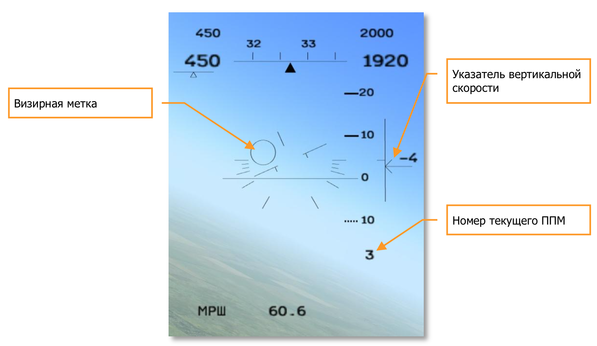

- В подрежиме ВОЗВРАТ визирная метка (большое кольцо) показывает на точку входа в глиссаду.
- Ручное переключение между аэродромами возврата осуществляется нажатием клавиши [[LCtrl-~]]. Номер текущего аэродрома индицируется ниже указателя вертикальной скорости. При подлете к аэродрому КП начнет руководить посадкой.
- В подрежиме ПОСАДКА появится метка отклонения от курсо-глиссады (МКГ). При отсутствии ошибок пилотирования метка находится в центре силуэта самолета.
- Визирная метка (большое кольцо) будет показывать требуемое направление полета самолета для выхода на глиссаду. При четком выдерживании режима снижения по глиссаде ВМ и МКГ должны находиться в центре силуэта самолета.
- Индексы "К" и "Г" сообщают о захвате курсового и глиссадного маяка соответственно.

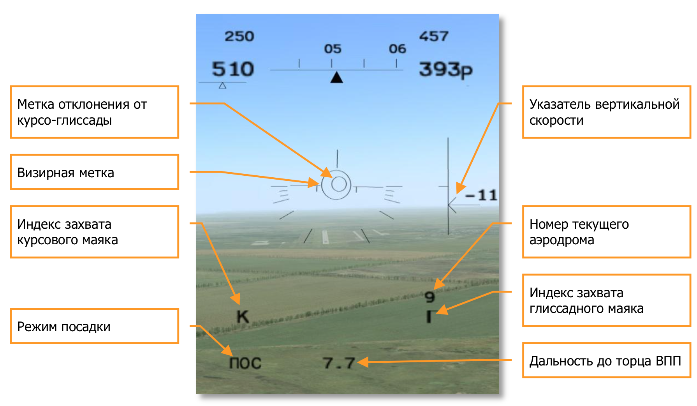

### Режим применения ракет "воздух-воздух" – Фи0

Режим применения ракет с ТГСН Фи0 (Фи–ноль) является основным режимом применения ракет "воздух-воздух" на самолете Су-25Т.
Принцип прицеливания в этом режиме чрезвычайно прост. После активизации режима Фи0 клавишами [[4]] или [[6]] автоматически выбираются к применению имеющиеся ракеты В-В с ТГСН (Р-60 или Р-73), и на ИЛС отображается индикация, приведенная на рисунке ниже.
В этом режиме активизируется ТГСН ракеты, которая имеет поле обзора в виде конуса с углом в 2 градуса вперед по оси ракеты. Для того чтобы ТГСН ракеты захватила цель, достаточно, чтобы цель попала в конус видимости ТГСН, центр которого индицируется прицельным крестом внутри силуэта самолета на ИЛС.
Для прицеливания необходимо маневром самолета наложить прицельный крест на цель. Когда ТГСН ракеты захватывает цель, немедленно выдается команда ПР. После появления этой команды можно выполнять пуск ракеты.
Обратите внимание, что при генерации команды ПР в этом режиме не учитывается дальность до цели, и, если захват произошел на значительной дальности, особенно на догонных курсах, есть большая вероятность, что ракете не хватит энергии и она не сможет догнать цель. Общие рекомендации в этом случае сводятся к тому, что необходимо определять дальность до цели визуально.
Следует учитывать, что дальность пуска ракет Р-60 в заднюю полусферу маневрирующей цели, летящей на скорости около 700 км/ч, составляет 1500-2000 метров, для ракет Р-73 аналогичная дальность составляет 3000-4000 метров.

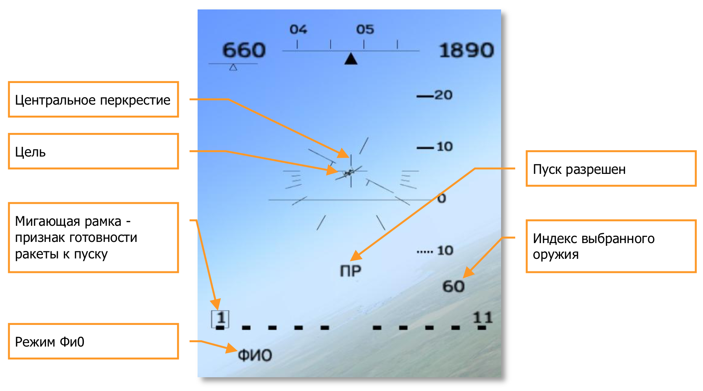

- В левом нижнем углу ИЛС индицируется индекс ФИ0 сообщающий о включенном режиме.
- В центре перекрестия видна цель.
- Команда ПР сообщает о том, что ТГСН ракеты захватила цель.
- Ниже шкалы тангажа высвечивается цифровой индекс выбранного оружия: для ракет Р-60 – 60 , для ракет Р-73 – 73.
- Ниже индицируются индексы наличия ракет и готовность к пуску. На рисунке выше видно, что ракеты Р-60 подвешены на 1-ю и 11-ю точки подвески, при этом ракета на точке 1 обрамлена мигающей квадратной рамкой, символизирующей о захвате ТГСН ракеты цели и о готовности к пуску.

### Режим применения оружия "воздух-поверхность"

Самолет Су-25Т может применять различные виды авиационных средств поражения класса "воздух-поверхность". В этот арсенал входят свободнопадающие и управляемые бомбы, неуправляемые авиационные ракеты (НАР), управляемые ракеты. Это один из немногих самолетов в арсенале ВВС России, который может применять современные высокоточные виды оружия, такие как противотанковые ракеты с лазерно-лучевой системой наведения "Вихрь", ракеты с лазерным и ТВ наведением Х-25МЛ, Х-29Л и Х-29Т, бомбы с ТВ наведением КАБ- 500Кр, а также противорадиолокационные ракеты Х-25МПУ и Х-58.

#### Бомбометание свободнопадающих АСП

В эту категорию входят все виды неуправляемых бомб, например, ФАБ-250, ФАБ-500, БетАБ-500, кассет – РБК-250, РБК-500 и контейнеров КМГУ, ЗАБ и т.д.

Для применения этих АСП по наземным целям включаем режим ЗЕМЛЯ [[7]] и выбираем, клавишей [[D]], свободнопадающие бомбы, кассеты или контейнеры.

В этом режиме появляются дополнительные символы на ИЛС для вывода прицельной информации. В нижнем левом углу появляется название режима ЗЕМЛЯ. Под шкалой тангажа индицируется тип АБСП, все свободнопадающие боеприпасы индицируются индексом АБ.

Методика применения свободнопадающих АСП практически одинакова, необходимо наложить прицельную марку на цель и, при условии соблюдения необходимых параметров сброса, при появлении команды ПР, произвести сброс нажатием на гашетку.

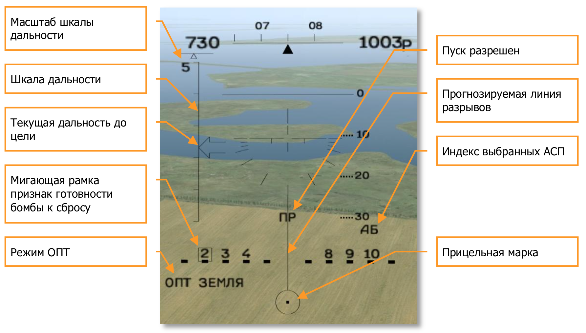

- В центре нижней части ИЛС находится прицельная марка, которая индицирует точку падения первой авиабомбы.
- От прицельной марки вверх идет прогнозируемая линия разрывов, которая указывает направление точек падения АБСП на местности.
- Под шкалой тангажа находится индекс класса авиационных средств поражения, авиабомбы – АБ.
- Команда ПР индицирует, что все начальные условия сброса, такие как дальность, высота и скорость выполнены, можно производить сброс.
- В левом нижнем углу находится индекс ОПТ и ЗЕМЛЯ, обозначающие режим бомбометания в визуальном режиме.
- Выше индицируются индексы наличия АБСП и готовность к сбросу. На рисунке выше видно, что авиабомбы подвешены на 2, 3, 4, 8, 9, 10-ю точки подвески, при этом авиабомба на точке 2 обрамлена мигающей квадратной рамкой, символизирующей о готовности к сбросу.

В случае применения АСП с тормозными устройствами, суббоеприпасов из КМГУ или некоторых кассетных боеприпасов, обладающих большим лобовым сопротивлением, из-за их быстрого торможения, прицельная марка даже при пикировании не поднимается с нижнего ограничителя ИЛС, т.е. ее невозможно наложить на цель. В этом случае лучше пользоваться режимом бомбометания в невидимую зону.
Для бомбометания в этом режиме, необходимо маневром самолета наложить прицельную марку, лежащую на нижнем ограничителе ИЛС, на цель и зажать гашетку. После этого на месте прицельной марки возникнет знак - ромб, привязаный к цели. В верхней части ИЛС появится директорное кольцо заданной перегрузки, в центр которого необходимо поместить конец "шпаги", вытягивающейся вверх из силуэта самолета.

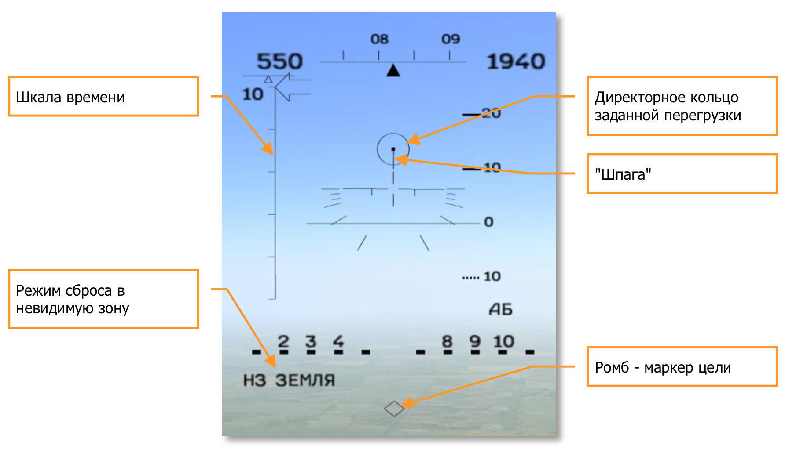

Шкала дальности слева превращается в шкалу времени до сброса, проградуированную в секундах. Стрелка-указатель оставшегося до сброса времени пойдет вниз по шкале только за 10 секунд до сброса. Для успешного бомбометания необходимо точно выдерживать параметры полета и держать текущую перегрузку - конец "шпаги" точно в центре директорного кольца заданной перегрузки. После того, как шкала времени обнулится, произойдет автоматический сброс бомб, после чего можно отпустить гашетку.

#### Применение НАР и встроенной пушечной установки

В категорию неуправляемых авиационных ракет (НАР) входят все ракеты и реактивные снаряды, не оснащенные какими-либо системами наведения. К ним относятся НАР типа С-5 в блоке УБ-32, С-8 в блоке Б-8, С-13 в блоке УБ-13, С-24, С-25. Неподвижная встроенная пушечная установка НППУ-8 включает в себя 30-мм двуствольную пушку ГШ-30 с боезапасом в 200 снарядов.

Для применения НАР необходимо включить режим ЗЕМЛЯ [[7]] и выбрать клавишей [[D]] необходимый тип НАР. При этом ИЛС примет следующий вид:

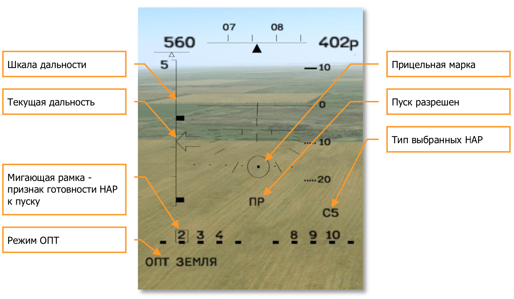

- Под силуэтом самолета появится прицельная марка, указывающая на точку падения ракет.
- Под шкалой тангажа индицируется тип выбранных НАР. На рисунке выше показан символ С5 для НАР С-5.
- Ниже индицируются индексы наличия АБСП данного типа.
- В нижнем левом углу ИЛС индицируется режим ОПТ ЗЕМЛЯ.

Для применения НАР необходимо визуально обнаружить цель и перевести самолет в пологое пикирование. В пикировании необходимо маневром самолета наложить ПМ на цель и при достижении разрешенной дальности пуска, когда стрелка на левой шкале дальности достигнет первой отметки и появится команда ПР, произвести пуск.

Применение встроенной пушечной установки почти не отличается от применения НАР. Для этого необходимо включить режим ЗЕМЛЯ [[7]] и выбрать ВПУ клавишей [[C]]. При этом ИЛС примет следующий вид:

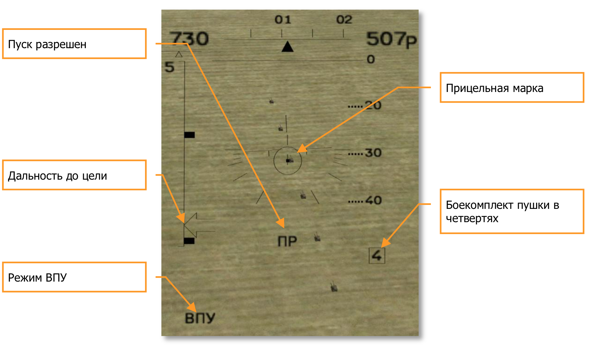

- Под силуэтом самолета появится прицельная марка, указывающая на точку падения снарядов.
- Под шкалой тангажа индицируется количество оставшегося боекомплекта в четвертях. Т.е. полный боекомплект отображается цифрой 4, последняя четверть – цифрой 1.
- В нижнем левом углу ИЛС индицируется режим ВПУ.

Для применения ВПУ необходимо визуально обнаружить цель и перевести самолет в пологое пикирование. В пикировании необходимо маневром самолета наложить ПМ на цель и при достижении разрешенной дальности стрельбы, когда стрелка на левой шкале дальности достигнет первой отметки, и появится команда ПР, произвести стрельбу.

### Применение высокоточного оружия "Воздух-Поверхность"

В категорию высокоточных авиационных средств поражения входят противотанковые управляемые ракеты с лазерно-лучевой системой наведения "Вихрь", управляемые ракеты с лазерной ГСН Х-25МЛ и Х-29Л, управляемые ракеты с ТВ-наведением Х-29Т, корректируемые авиабомбы с ТВ-наведением КАБ-500Кр.

Бомбы и ракеты с ТВ-наведением являются оружием класса "пустил-забыл" и не нуждаются в поддержке носителя после пуска, в отличие от ракет с лазерной ГСН, для которых надо подсвечивать цель бортовым лазером на протяжении всего полета боеприпаса.

Для применения всего спектра высокоточного оружия необходимо задействовать автоматический прицельный комплекс И-251 "Шквал", либо низкоуровневую телевизионную обзорно-прицельную систему "Меркурий", которая подвешивается под фюзеляж самолета в контейнере, при необходимости проведения ночных операций. Телевизионная картинка с обеих выводится на ТВ-индикатор ИТ-23М в правом верхнем углу приборной панели.

Для применения высокоточных АСП необходимо включить режим ЗЕМЛЯ [[7]], и включить либо комплекс "Шквал" [[O]], либо "Меркурий" [[RCtrl-O]]. При этом ИЛС примет следующий вид:

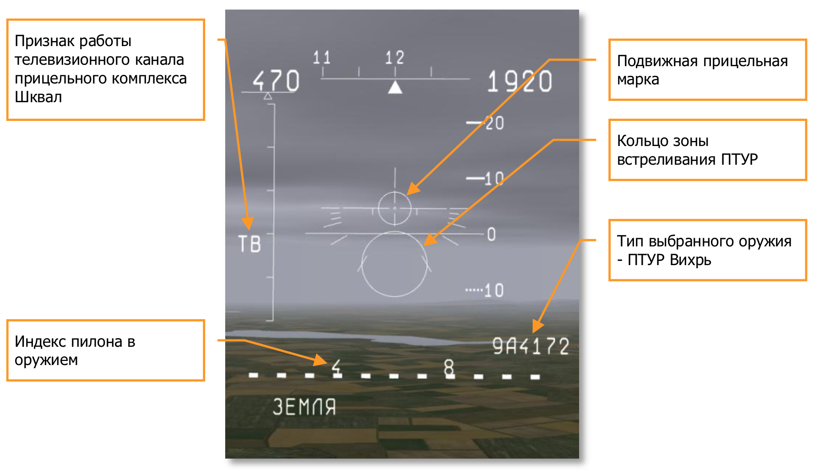

 В центре находится подвижная прицельная марка (ПМ) линии визирования (ЛВ) прицельного комплекса Шквал, которая может перемещаться управляющими клавишами [[,]], [[.]], [[/]], [[;]].
 Ниже находится кольцо зоны встреливания ПТУР. Для пуска ПТУР необходимо совместить прицельную марку с кольцом зоны встреливания.
 Слева от шкалы дальности индицируется индекс ТВ, признак работы комплекса "Шквал", при работе с системой Меркурий появляется индекс НТВ.
 Под шкалой тангажа индицируется название выбранного оружия, на рисунке выше индексом 9А4172 обозначаются противотанковые ракеты комплекса "Вихрь". Ракеты Х-25МЛ индицируются индексом 25МЛ, Х-29Л – 29Л, Х-29Т – 29Т, КАБ-500Кр – 500Кр.
 Ниже индицируются индексы пилонов, на которых подвешено оружие данного типа.
 В нижнем левом углу ИЛС индицируется режим ЗЕМЛЯ.

После этого производится поиск цели путем перемещения линии визирования прицельного комплекса клавишами [[,]], [[.]], [[/]], [[;]] с контролем изображения на ТВ индикаторе. При этом прицельная марка на ИЛС будет двигаться вслед за центром зоны обзора прицельного комплекса.

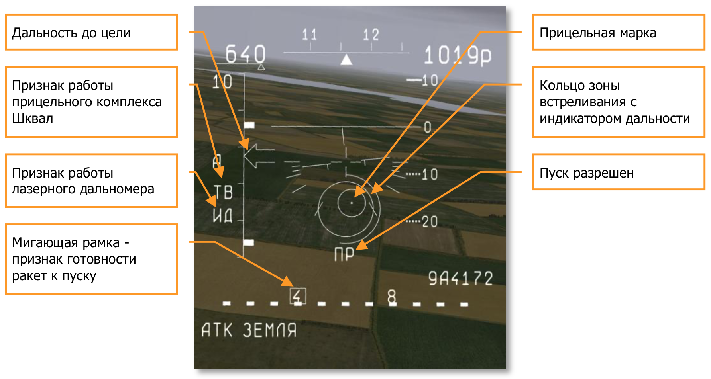

При включении прицельной системы на ТВ индикатор выводится изображение с ТВ камеры, поверх которого рисуется прицельная и полетная информация:

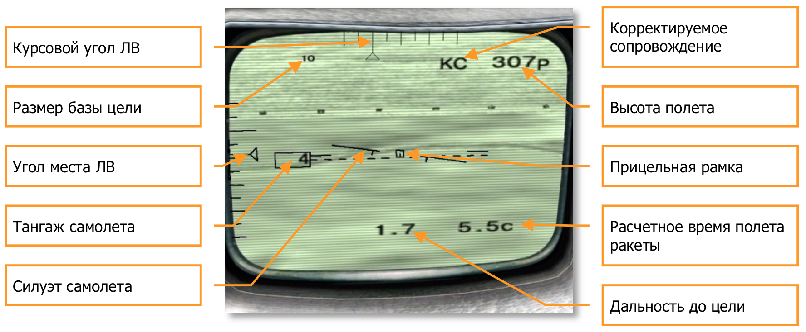

 В центре индикатора расположена прицельная рамка, размер которой зависит от
размера базы предполагаемой цели.
 В левом верхнем углу индицируется размер базы цели в метрах. На рисунке выше – 10 м. База цели - это характерная максимальная размерность цели. Для бронетехники она находится в пределах 10 метров, для ЛА - от 10 до 60 метров, в зависимости от типа, для кораблей и больших зданий - 60 метров. Автоматический захват возможен только в случае, когда база цели выставлена в соответствии с размерностями цели с точностью до 5 м, объекты более 60 м не требуют такой точности и захватываются автоматически при установке базы в значение 60 м. Клавиши [RCtrl-+], [RCtrl--].
 Сверху и слева находятся шкалы отклонения линии визирования (ЛВ). Текущее положение ЛВ индицируется треугольными индексами. Курсовая (верхняя) шкала проградуирована от +40 до -40 градусов, Шкала угла места (левая) проградуирована от +20 до -90 градусов.
 Правее шкалы угла места в прямоугольной рамке индицируется значение угла тангажа самолета.
 В центре индикатора, вокруг прицельной рамки расположен подвижный силуэт самолета, аналогичный индицируемому на ИЛС. По нему можно осуществлять контроль тангажа и крена самолета.
 В правом верхнем углу индицируется высота полета.
 Левее индицируется индекс КС – корректируемое сопровождение. Он обозначает, что
в данный момент комплекс находится в режиме поиска, захваченной цели нет.
 В нижнем правом углу индицируется расчетное время полета выбранной ракеты до цели в секундах. После пуска ракеты на этом месте индицируется время оставшееся до попадания ракеты в цель.
 Внизу индицируется значение наклонной дальности до цели вычисленное угломестным способом в километрах.

При обнаружении цели необходимо подвести к ней прицельную рамку, после чего прицельный комплекс сможет произвести автоматический захват. Для уверенного опознавания цели используется возможность сужать поле зрения ТВ камеры до значения 0,73 х 0,97 градуса, что позволяет получить максимальную кратность увеличения х23. Угол обзора (кратность увеличения) можно регулировать клавишами [[+]], [[-]] в три шага: х1, х8, х23.

После опознавания цели, необходимо выбрать требуемый тип средств поражения и проконтролировать дальность разрешенного пуска по шкале дальности на ИЛС. Если дальность до цели и другие стартовые условия позволяют произвести пуск, необходимо выполнить следующие операции.

В случае применения оружия с ТВ ГСН (ракеты Х-29Т или бомбы КАБ-500Кр) произвести пуск, нажав на гашетку, в случае применения оружия с лазерно-лучевой (ПТУР "Вихрь") или полуактивной лазерной (ракеты Х-25МЛ, Х-29Л) системами наведения, необходимо включить лазер клавишами [[RShift-O]], убедиться в выдаче команды ПР и произвести пуск.

При этом индикация на ТВ-индикаторе будет иметь следующий вид:

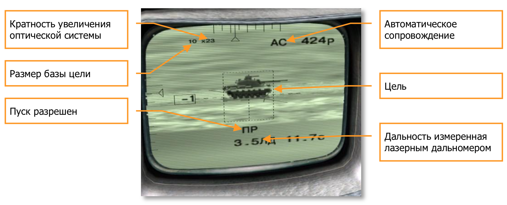

 В верхнем левом углу рядом с размером базы цели "10" на рисунке выше индицируется кратность увеличения ТВ системы комплекса. В данном случае - х23.
 В верхнем правом углу, левее показания радиовысотомера (424 м. на рисунке выше), индицируется индекс АС – автоматическое сопровождение. При этом прицельный комплекс автоматически отслеживает перемещение цели относительно самолета во всем диапазоне возможных углов автосопровождения, ±35 градусов по горизонтали и от +15 до -85 градусов по вертикали. Отклонению 0 градусов соответствует длинный штрих на вертикальной шкале и центральный – на горизонтальной.
 Внизу в центре индицируется значение наклонной дальности, полученное с помощью лазерного дальномера, о чем говорит индекс ИД, показанный за значением дальности.
 Выше индицируется команда "пуск разрешен" – ПР.

Поcле пуска ракет с лазерным наведением необходимо проконтролировать попадание и немедленно выключить лазер (ЛД). Это требование обусловлено с тем, что ЛД имеет очень теплонапряженный режим работы и не может функционировать длительное время.

После выключения ЛД необходимо время на охлаждение, приблизительно равное времени сеанса работы. ЛД автоматически отключается после достижения максимальной температуры.

В случае необходимости, есть возможность повторно включить лазер, не выжидая цикл охлаждения, путем быстрого пятикратного нажатия кнопок включения, после чего лазер будет работать 1 минуту до отключения. Последовательная работа более 4-5 минут без охлаждения, почти гарантированно выводит ЛД из строя. Не рекомендуется использовать лазер более 20 мин за полет, превышение этого лимита может привести к отказу устройства. В режиме охлаждения лазерного дальномера, индекс ЛД, индицирующийся с левой стороны шкалы дальности, мигает с частотой 2 Гц.

Необходимо также учитывать, что ракеты "Вихрь" можно пускать залпом по 2 штуки с небольшой задержкой, что позволяет увеличить вероятность поражения цели. Сверхзвуковая скорость полета ракет Вихрь также позволяет поразить несколько целей за один заход.
Ракетный комплекс "Вихрь" можно также использовать против неманевренных летательных аппаратов, таких как вертолеты и самолеты на взлетно-посадочных режимах. Порядок обнаружения и захвата такой же, как наземных целей, но необходимо учитывать, что вероятность поражения таких целей значительно ниже.

#### Применение противорадиолокационных ракет

Самолет Су-25Т имеет возможность применять противорадиолокационные ракеты (ПРР) Х- 25МПУ и Х-58 против радиоизлучающих целей, таких как РЛС обзора, РЛС подсвета целей и наведения ракет. Т.к. радиоизлучающие объекты имеют разные рабочие частоты, то существуют ограничения на применения ПРР по определенным типам целей. Например, ПРР не предназначены для поражения мобильных ствольных зенитных установок. За более детальной информацией о характеристиках ракет и поражаемых целях обращайтесь к главе - Оружие класса "воздух-поверхность" ВВС России.

Для применения противорадиолокационных ракет необходим подвесной контейнер станции радиотехнической разведки (РТР) и выдачи целеуказания для ПРР Л-081 "Фантасмагория", который подвешивается под фюзеляж самолета на 6-ю точку подвески.

Для применения ПРР необходимо включить режим ЗЕМЛЯ [[7]] и включить станцию РТР клавишей [[I]]. Далее, ориентируясь по показаниям системы предупреждения об облучении СПО-15 "Береза", направить самолет в направлении источника излучения. В случае, когда источник излучения войдет в зону обзора станции РТР, т.е. ±30 градусов от оси самолета, на ИЛС появятся маркер цели в виде ромба. Если выбранный тип оружия имеет возможность поражать обнаруженную цель, под маркером появляется название типа цели. При этом ИЛС будет иметь следующий вид:

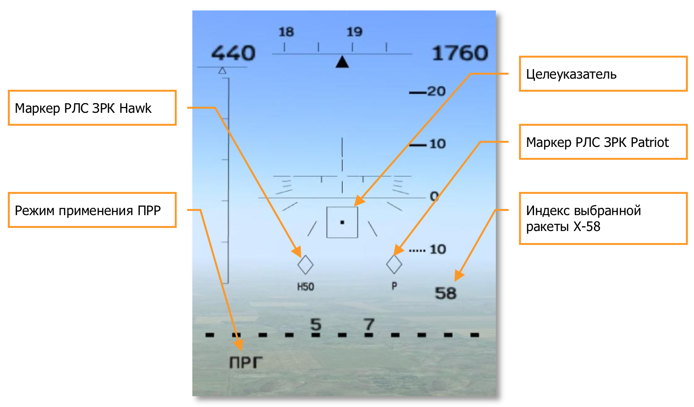

- В центре ИЛС, под силуэтом самолета, находится целеуказатель в виде квадратной рамки, предназначенный для выделять требуемой цели. Перемещается управляющими клавишами [[,]], [[.]], [[/]], [[;]].
- Под шкалой тангажа индицируется индекс выбранного типа ракет 58 – Х-58.
- В левом нижнем углу индицируется название режима целеуказания для ПРР – ПРГ (программирование радиолокационных головок).
- В нижней части ИЛС присутствуют два маркера цели в виде ромбов. Под целями, которые можно атаковать выбранным типом ракет индицируются их типы, P – РЛС ЗРК "Patriot", H50 – РЛС ЗРК "Hawk".

После того как на ИЛС появились маркеры целей, необходимо принять решение о поражении цели и выделить ее целеуказателем. Для этого необходимо переместить целеуказатель клавишами [[,]], [[.]], [[/]], [[;]] на цель и нажать клавишу захвата [[Enter]]. После этого цель обрамляется круглым маркером. На шкале дальности появляется стрелка, которая индицирует текущую дальность до цели и риска максимальной дальности пуска.

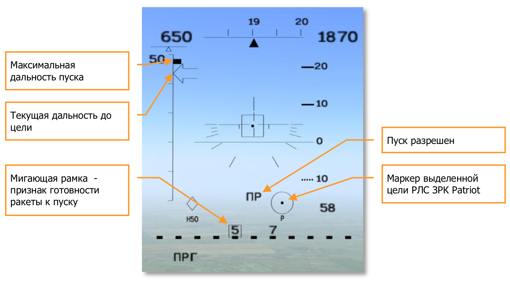

- На шкале дальности находится риска максимальной дальности пуска.
- С правой стороны шкалы перемещается стрелка, указывающая на текущую дальность до цели.
- После выделения цели целеуказателем цель обрамляется круглым маркером.
- В случае соблюдения стартовых условий и разрешенной дальности пуска, появляется команда "пуск разрешен" - ПР.
- Мигающая рамка вокруг индекса пилона под номером 5 обозначает готовность ракеты к пуску.

В случае соблюдения стартовых условий и разрешенной дальности пуска появляется команда "пуск разрешен" – ПР, после чего необходимо произвести пуск нажатием на гашетку.

### Сетка

Неподвижная сетка является резервным прицельным средством. Она обычно применяется для стрельбы из пушек в случае отказа основных прицельных систем, либо в случае невозможности получения точной прицельной информации от основных прицельных систем в текущих условиях полета. Сетка представляет собой проградуированную двухмерную шкалу. Используется для прицеливания с учетом известных табличных поправок для выбранного оружия и текущих условий полета. Центр сетки совмещен с осевой линией самолета.

Неподвижная сетка может быть выведена на ИЛС в любом боевом режиме клавишей [[8]], при этом текущий режим сохраняется, но индикация на ИЛС заменяется сеткой. Отключение неподвижной сетки производится также нажатием клавиши [[8]].

Поправки стрельбы выбираются летчиком путем выноса центра перекрестия сетки относительно цели на требуемый угол с помощью масштабных делений сетки. Прицеливание и стрельба ведется сопроводительно-заградительным способом на дальности 200-400 метров. В процессе атаки необходимо маневром самолета добиться такого положения цели, при котором продолжение продольной оси цели проходило бы через центр перекрестия сетки.

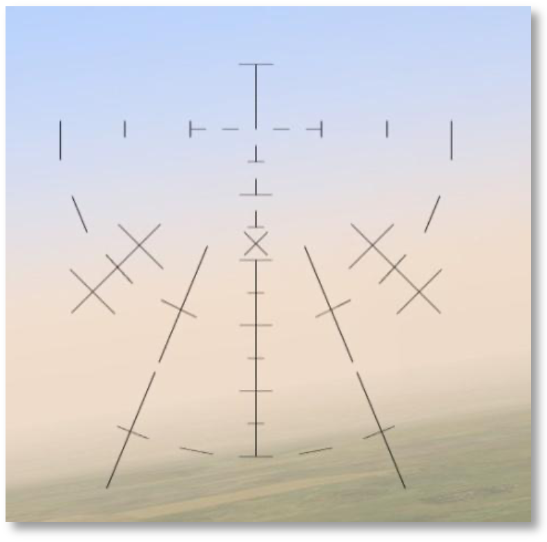

{!abbr.md!}

