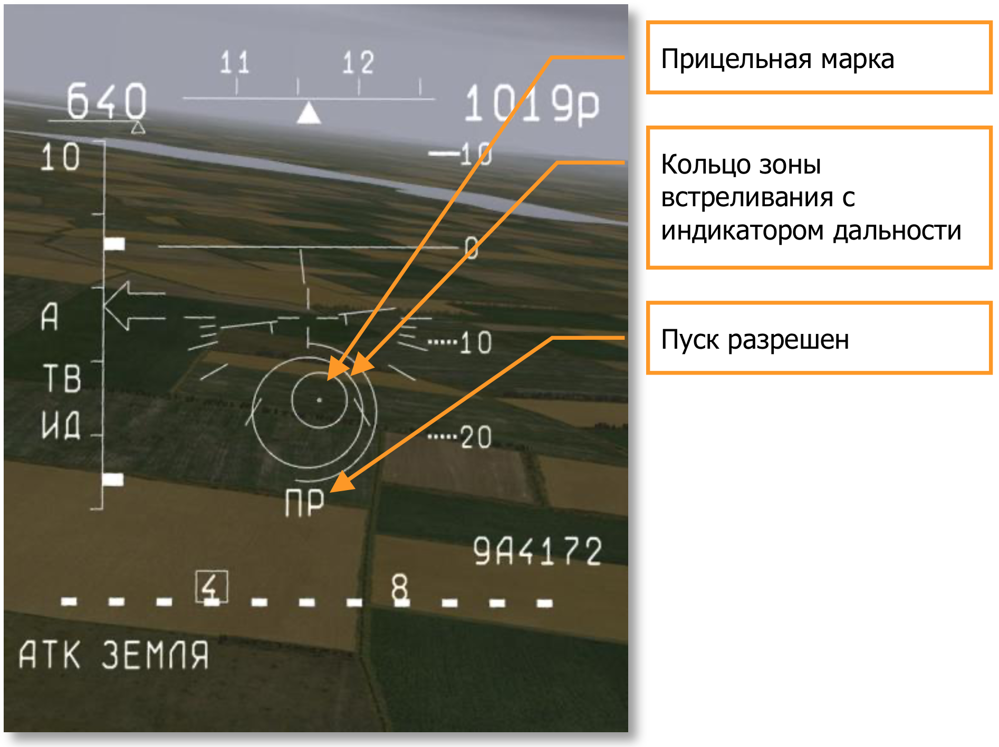

# Применение оружия

Все системы управления оружием (СУО) современных самолётов обладают только им присущими особенностями эксплуатации. Достаточно сильно отличаются подходы к построению взаимодействия летчика и системы управления вооружением (СУВ) на американских и российских самолётах. В данном разделе приводится информация о последовательностях действий летчика с элементами СУВ, необходимых для успешного применения оружия.

Обычно, для применения оружия летчику необходимо выполнить следующие шаги:

- Обнаружить цель
- Захватить цель
- Применить оружие

Штурмовик Су-25Т является наиболее совершенным тактическим ударным самолётом, состоящим на вооружении ВВС РФ. Он способен наносить удары высокоточным оружием по различным видам целей, в том числе, и по малоразмерным подвижным в любое время суток.

Самолёт оборудован телевизионным прицельным комплексом И-251 «Шквал», скомплексированным с лазерным дальномером-целеуказателем «Причал». Для действий в темное время суток возможна подвеска ночной низкоуровневой телевизионной прицельной системы «Меркурий».

Самолёт также может нести ракеты ближнего боя Р-73 и Р-60 для самообороны.

## Применение оружия «воздух-воздух»

### Применение ракет ближнего боя Р-73 и Р-60

Самолёт имеет возможность применять ракеты ближнего боя Р-73 и Р-60 в режиме Фи0. В этом режиме активизируется ГСН ракеты, которая имеет поле обзора в виде конуса, с углом раскрыва 2 градуса вперед по оси ракеты. Для того, чтобы ГСН ракеты захватила цель, достаточно, чтобы цель попала в конус видимости ГСН, центр которого индицируется прицельным крестом внутри силуэта самолёта на ИЛС.

Процедура захвата и обстрела цели состоит из нескольких шагов:

1. При обнаружении визуально видимой воздушной цели необходимо включить режим Фи0 клавишей режима «воздух-воздух» [[6]]. Выбрать необходимый тип ракет клавишей [[D]] контролируя тип по индикации на ИЛС.
2. Маневром самолёта необходимо добиться положения цели близко к центральному перекрестию ИЛС. Когда цель окажется в зоны обзора ГСН ракеты, будет слышен звуковой сигнал — аналог команды ПР, сигнализирующий о захвате цели ГСН ракеты.
3. Визуально определить дальность до цели, и, если она меньше максимальной разрешенной дальности пуска выбранных ракет, произвести пуск, нажав кнопку стрельбы на джойстике или [[Space]] на клавиатуре.
Обратите внимание, что при генерации команды ПР в этом режиме не учитывается дальность до цели, и, если захват произошел на значительной дальности, особенно на догонных курсах, есть большая вероятность, что ракете не хватит энергетики, и она не сможет долететь до цели. Общие рекомендации в этом случае сводятся к тому, что необходимо определять дальность до цели визуально.

### Применение ВПУ и СППУ против воздушных целей

Применение ВПУ и ВППУ против воздушных целей возможно с ограниченной точностью.

1. Визуально опознать цель.
2. Выбрать режим «воздух-воздух» [[6]]. Выбрать к применению ВПУ или СППУ клавишей [[C]]. В этом режиме на ИЛС индицируется «прогноз-дорожка», которая графически представляет трассу полета снарядов. Выставить клавишами [[RAlt]] + [[-]], [[RAlt]] + [[+]] требуемую базу цели, которая равна размаху крыльев в метрах. База цели индицируется в верхней части ИЛС.
3. Маневром самолёта наложить «прогноз-дорожку» на цель таким образом, чтобы концы крыльев цели касались границ «дорожки» и произвести стрельбу, нажав кнопку стрельбы на джойстике или [[Space]] на клавиатуре.

Эффективный огонь можно вести с дальности менее 800 метров. Стоит также учитывать, что точность стрельбы повышается при совпадении плоскостей маневра цели и вашего самолёта. Стрельба в режиме «прогноз-дорожка» возможна только на догонных курсах.

## Применение оружия «воздух-земля»

Самолёты типа Су-25Т могут нести широкий спектр авиационных средств поражения, в том числе свободнопадающие бомбы, бомбовые контейнеры и кассеты, НАРы, управляемые ракеты с телевизионным, лазерным и лазерно-лучевым наведением, телевизионные корректируемые бомбы, съемные подвижные пушечные установки.

### Применение свободнопадающих бомб с низким сопротивлением

В эту категорию бомб входят обычные свободнопадающие бомбы ФАБ-100, ФАБ-250, ФАБ-500. Они имеют достаточно низкий коэффициент сопротивления и пологую траекторию, благодаря чему есть возможность прицелиться и произвести сброс по визуально видимой цели.

1. Визуально опознать цель.
2. Переключить СУВ в режим применения оружия по земле [[7]]. Выбрать необходимые АСП клавишей [[D]], контролируя тип по индикации на ИЛС. На щитке СУВ необходимо выбрать количество сбрасываемых боеприпасов [[LCtrl]] + [[Space]], а также, при необходимости, интервал сброса между ними [[V]]. В пологом пикировании на цель поддерживать скорость
500-600 км/ч.
3. Когда прицельная марка начнет двигаться от нижней границы отражателя ИЛС, совместить ее с целью и, при выполнения условий разрешающих сброс, после появления команды ПР произвести сброс бомб, нажав кнопку стрельбы на джойстике или [[Space]] на клавиатуре. В случае, если к разгрузке выбрана серия авиабомб, необходимо держать кнопку стрельбы нажатой до окончания разгрузки.

!!! info
    Бомбы можно сбрасывать после появления на ИЛС символа ПР. Перед сбросом бомб необходимо перевести самолёт в пологое пикирование. колебания по крену, тангажу и рысканью, а также значительные изменения скорости приведут к отклонению места падения бомб от планируемого.

### Применение свободнопадающих бомб с тормозными устройствами

В эту категорию бомб входят свободнопадающие бомбы с тормозными устройствами, бомбовые контейнеры КМГУ, а также бетонобойные бомбы БетАБ. Они имеют высокий коэффициент сопротивления и достаточно крутую траекторию, что затрудняет прицеливание по визуально видимой цели.

Применять данные боеприпасы рекомендуется в режиме сброса в невидимую зону — «под капот». Для этого необходимо проделать следующие шаги.

1. Визуально опознать цель.
2. Переключить СУВ в режим применения оружия по земле [[7]]. Выбрать необходимые АСП
клавишей [[D]], контролируя тип по индикации на ИЛС.
3. Совместить прицельную марку, лежащую на нижней границе отражателя ИЛС, с целью и зажать кнопку стрельбы на джойстике или [[Space]] на клавиатуре. При этом инерциальная система начнет счисление точки сброса, на месте прицельной марки возникнет знак — ромб, который привязан к цели. В верхней части ИЛС появится директорное кольцо заданной перегрузки, в центр которого необходимо поместить конец «шпаги», вытягивающейся вверх из силуэта самолёта.

    Шкала дальности слева на ИЛС превращается в шкалу времени до сброса, проградуированную в секундах. Стрелка-указатель оставшегося до сброса времени пойдет вниз по шкале только за 10 секунд до сброса. Для успешного бомбометания необходимо точно выдерживать параметры полета по крену и рысканию. После того, как шкала времени обнулится, произойдет автоматический сброс АСП.
4. Отпустить кнопку стрельбы.

### Бомбометание с предварительной засечкой цели

Свободнопадающие АСП можно применять с предварительной засечкой цели с помощью телевизионного прицельного комплекса «Шквал» или ночной прицельной станцией «Меркурий».

Процедура бомбометания в этом режиме состоит из нескольких шагов:

1. Переключить СУВ в режим применения оружия по земле [[7]]. Выбрать необходимый тип АСП клавишей [[D]], контролируя тип по индикации на ИЛС. Для обнаружения и опознавания цели необходимо включить прицельный комплекс «Шквал» [[O]] или ночную станцию «Меркурий» [[RCtrl]] + [[O]]. Произвести поиск цели, переместив клавишами [[;]], [[,]], [[.]], [[/]] зону обзора прицельного комплекса в нужном направлении. При обнаружении цели стабилизировать зону обзора нажатием клавиши [[Enter]]. Для уверенного опознавания цели можно увеличить изображение клавишами [[+]], [[-]].
2. После обнаружения и опознавания цели необходимо поместить прицельную рамку на цели. Направить самолёт по курсу на цель и включить лазерный дальномер-целеуказатель клавишами [[RShift]] + [[O]].
3. Зажать кнопку стрельбы на джойстике или [[Space]] на клавиатуре. При этом инерциальная система начнет счисление точки сброса, на месте прицельной марки возникнет знак — ромб, который привязан к цели. В верхней части ИЛС появится директорное кольцо заданной перегрузки, в центр которого необходимо поместить конец «шпаги», вытягивающейся вверх из силуэта самолёта. Шкала дальности слева на ИЛС превратится в шкалу времени до сброса, проградуированную в секундах. Стрелка- указатель оставшегося до сброса времени пойдет вниз по шкале только за 10 секунд до сброса. Для успешного бомбометания необходимо точно выдерживать параметры полета по крену и рысканию. После того, как шкала времени обнулится, произойдет автоматический сброс АСП.
4. Отжать кнопку стрельбы. Выключить лазерный дальномер [[RShift]] + [[O]]. Необходимо учитывать, что лазерный дальномер-целеуказатель имеет ограниченное время непрерывной работы, которое составляет около одной минуты, затем устройству необходимо время для охлаждения. При этом транспарант Л на ИЛС мигает с частотой 2 Гц. После истечения времени необходимого на охлаждение, транспарант Л гаснет. Время охлаждения приблизительно равно времени работы и зависит от температурных условий окружающей среды. При частом и продолжительном использовании лазерного дальномера он может выйти из строя.

В случае применения КМГУ необходимо выносить точку прицеливания ближе, т.к. сброс суббоеприпасов из КМГУ происходит не мгновенно, а только после открытия створок грузовых отсеков.

### Применение НАР и НППУ

В категорию неуправляемых авиационных ракет (НАР) входят все ракеты и реактивные снаряды, не оснащенные какими-либо системами наведения. К ним относятся НАР типа С-5 в блоке УБ-32, С-8 в блоке Б-8, С-13 в блоке УБ-13, С-24, С-25. Неподвижная встроенная пушечная установка НППУ-8 включает в себя 30-мм двуствольную пушку ГШ-30 с боезапасом в 200 снарядов.

1. Визуально опознать цель.
2. Переключить СУВ в режим применения оружия по земле [[7]]. Выберать необходимые НАР клавишей [[D]] или встроенную пушечную установку [[C]], контролируя тип по индикации на ИЛС. Перевести самолёт в пологое пикирование на цель.
3. Когда прицельная марка совместится с целью и условия пуска будут соблюдены (загорится команда ПР), открыть огонь, нажав кнопку стрельбы на джойстике или [[Space]] на клавиатуре.

### Применение СППУ

Самолёт Су-25Т может применять съемные подвижный пушечные установки СППУ-22-1 с неотклоненными блоками стволов, в режиме фиксированного угла отклонения блоков стволов и в режиме программного (следящего) отклонения блоков стволов.

Так как режим стрельбы из СППУ с неотклоненными блоками стволов ничем не отличается от режима стрельбы из НППУ, то мы рассмотрим только два режима: с фиксированным углом отклонения блоков стволов и режим программного (следящего) отклонения блоков стволов.

Режим с фиксированным отклонением блоков стволов применяют при стрельбе с горизонтального полета по протяженным целям:

1. Визуально опознать цель.
2. Переключить СУВ в режим применения оружия по земле [[7]]. Выбрать режим стрельбы из ВПУ нажатием клавиши [[C]].
    1. Далее переключиться на СППУ сочетанием клавиш [[LCtrl]] + [[Space]] и проконтролировать выбор оружия по ИЛС и щитку СУВ. При этом будут выбраны два контейнера СППУ. На переключателе режимов разгрузки будет выбран режим ФИКС, а на переключателе вариантов разгрузки — ПО 2.
    2. Если у вас на подвеске находятся четыре контейнера СППУ, то необходимо еще раз нажать [[LCtrl]] + [[Space]] и проконтролировать выбор оружия по щитку СУВ. При этом на переключателе режимов разгрузки будет выбран режим ФИКС, а на переключателе вариантов разгрузки — ПО 4.
3. Клавишами [[RAlt]] + [[-]], [[RAlt]] + [[+]] изменить угол наклона стволов, ориентируясь по прицельной марке на ИЛС.
4. Совершите необходимый маневр для выхода на курс вдоль протяженной цели и переведите самолёт в сбалансированный горизонтальный полет. Когда прицельная марка на ИЛС совместится с начальной точкой протяженной цели, открыть огонь, нажав кнопку стрельбы на джойстике или [[Space]] на клавиатуре.

Во время стрельбы можно незначительно менять траекторию полета с помощью руля направления. Любые колебания по крену могут привести к значительному промаху.

Режим программного (следящего) отклонения блоков стволов применяется для поражения точечных целей:

1. Визуально опознать цель.
2. Переключить СУВ в режим применения оружия по земле [[7]]. Выбрать режим стрельбы из ВПУ нажатием клавиши [[C]].
    1. Далее переключить типа оружия на СППУ сочетанием клавиш [[RCtrl]] + [[Space]] и проконтролируйте выбор оружия по ИЛС и щитку СУВ. При этом будут выбраны два контейнера СППУ. На переключателе режимов разгрузки будет выбран режим ФИКС, а на переключателе вариантов разгрузки — ПО 2.
    2. Если у вас на подвеске находятся четыре контейнера СППУ, то необходимо еще раз нажать [[Ctrl]] + [[Space]] и проконтролировать выбор оружия по щитку СУВ. При этом на переключателе режимов разгрузки будет выбран режим ФИКС, а на переключателе вариантов разгрузки — ПО 4.
3. Клавишами [[RAlt]] + [[-]], [[RAlt]] + [[+]] изменить угол наклона стволов, ориентируясь по прицельной марке на ИЛС.
4. Включить лазерный дальномер [[RShift]] + [[O]], на переключателе режимов разгрузки будет выбран режим ПРОГР.
5. В пологом пикировании совместите прицельную марку с целью и, при появлении команды ПР, откройте огонь, нажав кнопку стрельбы на джойстике или [[Space]] на клавиатуре. Во время стрельбы для минимизации промаха необходимо исключить любые колебания самолёта по крену и рысканию.
6. После поражения цели выключить лазерный дальномер-целеуказатель клавишами [[RShift]] + [[O]] и выйти из атаки.

### Применение бомб и ракет с телевизионным наведением

Самолёт Су-25Т может применять бомбы КАБ-500Кр и ракеты Х-29Т с ТВ ГСН. Оружие этого типа позволяет осуществить принцип «пустил-забыл» и не требует поддержки самолёта носителя после сброса или пуска. Данные типы АСП рассчитаны для уничтожения заглубленных командных центров, пунктов управления, железобетонных укрытий, а также других хорошо защищенных целей. Ракеты типа Х-29Т могут поражать корабли.

Самое существенное ограничение этого вида оружия — это невозможность применения в темное время суток и в плохих метеоусловиях.

Процедура обнаружения, захвата и обстрела цели состоит из нескольких шагов:

1. Переключить СУВ в режим применения оружия по земле [[7]]. Выбрать необходимый тип АСП клавишей [[D]], контролируя тип по индикации на ИЛС. Для обнаружения и опознавания цели необходимо включить прицельный комплекс «Шквал» [[O]]. Далее необходимо произвести поиск цели, переместив клавишами [[;]], [[,]], [[.]], [[/]] зону обзора прицельного комплекса в нужном направлении. При обнаружении цели стабилизировать зону обзора нажатием клавиши [[Enter]]. Для уверенного опознавания цели можно увеличить изображение клавишами [[+]], [[-]].
2. Для захвата цели необходимо корректно выставить базу цели. По умолчанию база цели составляет 10 м. Это характерный максимальный размер объекта. Рекомендуется использовать следующие значения баз цели:

    - Люди и мелкие сооружения — 5 м.
    - Автомобили и бронетехника — 10 м.
    - Самолёты тактической авиации и вертолеты — 20 м.
    - Транспортные и стратегические самолёты — 30...60 м.
    - Здания — 20...60 м.
    - Корабли — 60 м.

    Прицельный комплекс «Шквал» произведет автоматический захват ближайшего к прицельной рамке объекта, размерность которого сопоставима с базой цели. В случае захвата постороннего объекта необходимо управляющими клавишами [[;]], [[,]], [[.]], [[/]] передвинуть прицельную рамку в сторону цели.

    После захвата цели на ТВ индикаторе появится индекс «АС» — автоматическое сопровождение.

3. Проконтролировать дальность до цели по шкале дальности на ИЛС. При достижении дальности разрешенного пуска и появлении команды ПР, произвести сброс или пуск, нажав кнопку стрельбы на джойстике или [[Space]] на клавиатуре.

После сброса или пуска можно сразу приступать к выполнению дальнейшей задачи.

Необходимо заметить, что АСП с телевизионными ГСН невозможно применять в условиях ограниченной видимости и ночью, т.к. они работают в оптическом диапазоне и подвержены всем ограничениям по видимости, характерным для дневных телевизионных устройств. Для уверенного захвата цели необходимо, чтобы цель была освещена естественным или искусственным источником света.

### Применение бомб и ракет с лазерным наведением

Самолёт Су-25Т может применять ракеты Х-29Л, Х-25МЛ с лазерным наведением и противотанковый ракетный комплекс «Вихрь» с лазерно-лучевым наведением. Ракеты Х-25МЛ и Х-29Л рассчитаны для уничтожения заглубленных командных центров, пунктов управления, железобетонных укрытий и сооружений, позиций ПВО и артиллерии, а также других защищенных целей. Ракетный комплекс «Вихрь» с ракетой 9А4172 является специализированным противотанковым комплексом для борьбы с бронированными малоразмерными подвижными целями.

Процедура обнаружения, захвата и обстрела цели состоит из нескольких шагов:

1. Переключить СУВ в режим применения оружия по земле [[7]]. Выбрать необходимый тип ракет клавишей [[D]], контролируя тип по индикации на ИЛС. Для обнаружения и опознавания цели необходимо включить прицельный комплекс «Шквал» [[O]] или станцию «Меркурий» [[RCtrl]] + [[O]]. Далее необходимо произвести поиск цели переместив клавишами [[;]], [[,]], [[.]], [[/]] зону обзора прицельного комплекса в нужном направлении. При обнаружении цели стабилизировать зону обзора нажатием клавиши [[Enter]]. Для уверенного опознавания цели можно увеличить изображение клавишами [[+]], [[-]].
2. Для захвата цели необходимо корректно выставить базу цели. По умолчанию база цели составляет 10 м. Это характерный максимальный размер объекта. Рекомендуется использовать следующие значения баз цели:

    - Люди и небольшие сооружения — 5 м.
    - Автомобили и бронетехника — 10 м.
    - Самолёты тактической авиации и вертолеты — 20 м.
    - Транспортные и стратегические самолёты — 30...60 м.
    - Здания — 20...60 м.
    - Корабли — 60 м.

    Прицельный комплекс произведет автоматический захват ближайшего к прицельной рамке объекта, размерность которого сопоставима с базой цели. В случае захвата постороннего объекта, необходимо, управляющими клавишами [[;]], [[,]], [[.]], [[/]], передвинуть прицельную рамку в сторону цели.

    После захвата цели на ТВ индикаторе появится индекс «АС» — автоматическое сопровождение.

3. Проконтролировать дальность до цели по шкале дальности на ИЛС. При достижении дальности разрешенного пуска, необходимо включить лазерный дальномер-целеуказатель [[RShift]] + [[O]] и проконтролировать появлении команды ПР. Произвести пуск, нажав кнопку стрельбы на джойстике или [[Space]] на клавиатуре.
4. По экрану телевизионного индикатора проконтролировать поражение цели, в случае необходимости, если позволяет дистанция, произвести повторный пуск. После пуска ракет необходимо подсвечивать цель лазером до попадания. В это время самолёт ограничен в маневре, допустимые углы маневрирования лежат в пределах углов сопровождения цели прицельного комплекса «Шквал».
5. После поражения цели выключить лазерный дальномер-целеуказатель клавишами [[RShift]] + [[O]] и выйти из атаки. Необходимо учитывать, что лазерный дальномер- целеуказатель имеет ограниченное время непрерывной работы, которое составляет около одной минуты, затем устройству необходимо время для охлаждения. При этом транспарант «ЛД» на ИЛС и ТВ-индикаторе мигает с частотой 2 Гц. После истечения времени необходимого на охлаждение, транспарант «ЛД» гаснет. Время охлаждения приблизительно равно времени работы и зависит от температурных условий окружающей среды. При частом и продолжительном использовании лазерного дальномера он может выйти из строя.

### Применение ПТУР «Вихрь»

Процедура обнаружения, захвата и обстрела цели состоит из нескольких шагов:

1. Переключить СУВ в режим применения оружия по земле [[7]]. Выбрать необходимый тип ракет клавишей [[D]], контролируя тип по индикации на ИЛС. Для обнаружения и опознавания цели необходимо включить прицельный комплекс «Шквал» [[O]] или станцию «Меркурий» [[RCtrl]] + [[O]]. Далее необходимо произвести поиск цели переместив клавишами [[;]], [[,]], [[.]], [[/]] зону обзора прицельного комплекса в нужном направлении. При обнаружении цели стабилизировать зону обзора нажатием клавиши [[Enter]]. Для уверенного опознавания цели можно увеличить изображение клавишами [[+]], [[-]].
2. Для захвата цели необходимо корректно выставить базу цели. По умолчанию база цели составляет 10 м.
Прицельный комплекс произведет автоматический захват ближайшего к прицельной рамке объекта, размерность которого сопоставима с базой цели. В случае захвата постороннего объекта, необходимо, управляющими клавишами [[;]], [[,]], [[.]], [[/]], передвинуть прицельную рамку в сторону цели.
После захвата цели на ТВ индикаторе появится индекс «АС» — автоматическое сопровождение.
3. Проконтролировать дальность до цели по шкале дальности на ИЛС. При достижении дальности разрешенного пуска, необходимо включить лазерный дальномер-целеуказатель [[RShift]] + [[O]].

    Маневром самолёта совместить кольцо зоны встреливания с прицельной маркой и проконтролировать появлении команды ПР. Произвести пуск, нажав кнопку стрельбы на джойстике или [[Space]] на клавиатуре.

    

4. По экрану телевизионного индикатора проконтролировать поражение цели, в случае необходимости, если позволяет дистанция, произвести повторный пуск. Во время полета ракеты избегать резкого маневрирования во избежание выходя ракеты из лазерного растра.
5. После поражения цели выключить лазерный дальномер-целеуказатель клавишами [[RShift]] + [[O]] и выйти из атаки.
6. Ракетный комплекс «Вихрь» может ограниченно применяться против низкоскоростных воздушных целей типа вертолетов или низкоскоростных самолётов. Методика поиска и захвата воздушных целей аналогична описанной выше. Однако, стоит учитывать, что дальность пуска по воздушным целям, особенно на догонных курсах, существенно снижается. Рекомендуется применять ракеты комплекса «Вихрь» по воздушным целям, на дальности менее 3...5 км в зависимости от скорости и ракурса цели.

### Применение противорадарных ракет

Самолёт Су-25Т может применять противорадарные ракеты Х-25МПУ и Х-58 по радиоизлучающим целям. В список целей входят все основные РЛС обзора и наведения ракет современных комплексов ПВО. Для применения этого типа оружия на самолёт должен быть подвешен контейнер станции целеуказания Л-081 «Фантасмагория».

Процедура обнаружения, захвата и обстрела цели состоит из нескольких шагов:

1. Переключить СУВ в режим применения оружия по земле [[7]]. Выбрать необходимый тип
ракет клавишей [[D]], контролируя тип по индикации на ИЛС.
2. При обнаружении угрозы на СПО необходимо развернуть самолёт в направлении угрозы и включить режим программирования радиолокационных головок ракет — ПРГ клавишей [[I]]. Станция целеуказания обнаружит цель, на ИЛС будут выведена метка и индекс угрозы.

Типы угроз и ассоциированных с ними индексов, приведены в таблице ниже:

Комплекс ПВО или корабль | Наименование РЛС    | Обозначение в режиме ПРГ
-------------------------|---------------------|-------------------------
Patriot                  | AN/MPQ-53           | P
Improved Hawk            | AN/MPQ-50           | H50
Improved Hawk            | AN/MPQ-46           | H46
Roland                   | Roland search radar | G
Roland                   | Roland              | R
С-300ПС                  | РПН 30Н6            | 30Н6
С-300ПС                  | НВО 5Н66М           | 5Н66
С-300ПС                  | РЛО 64Н6Е           | 300
C-125                    | РЛО П-19            | П19
C-125                    | СНР                 | 125
Бук                      | 9С18М1              | БУК
Куб                      | 1С91                | КУБ
Оса                      | 9А33                | ОСА
Тор                      | 9А331               | ТОР
Стрела-10                | Радиодальномер      | С10
Тунгуска                 | 2С6                 | 2С6
USS "Carl Vinson"        | Sea Sparrow         | SS
CG "Ticonderoga"         | SM2                 | SM2
FFG "Oliver H. Perry"    | SM2                 | SM2
ТАКР "Адмирал Кузнецов"  | Кинжал              | КНЖ
ФР "Неустрашимый"        | Кинжал              | КНЖ
РК "Москва"              | Форт                | ФРТ
МПК "Альбатрос"          | Оса-М               | ОСА
СКР "Резкий"             | Оса-М               | ОСА

Управляющими клавишами [[;]], [[,]], [[.]], [[/]], наложить целеуказатель на метку цели и нажать клавишу захвата [[Enter]]. Контролировать дальность до цели по шкале дальности на ИЛС. При достижении дальности пуска и появлении команды ПР произвести пуск ракеты.

Противорадарные ракеты являются оружием класса «пустил-забыл» и не требуют поддержки носителя после пуска. После пуска ракеты можно продолжить выполнение задачи, либо начать выполнение противоракетного маневра.

Необходимо четко представлять степень опасности различных ЗРК и наносить удар в первую очередь по наиболее опасным комплексам. Например, к таковым относятся ЗРК типа C-300 или Patriot, и их необходимо уничтожать ракетами типа Х-58 в приоритетном порядке.

{!abbr.md!}
